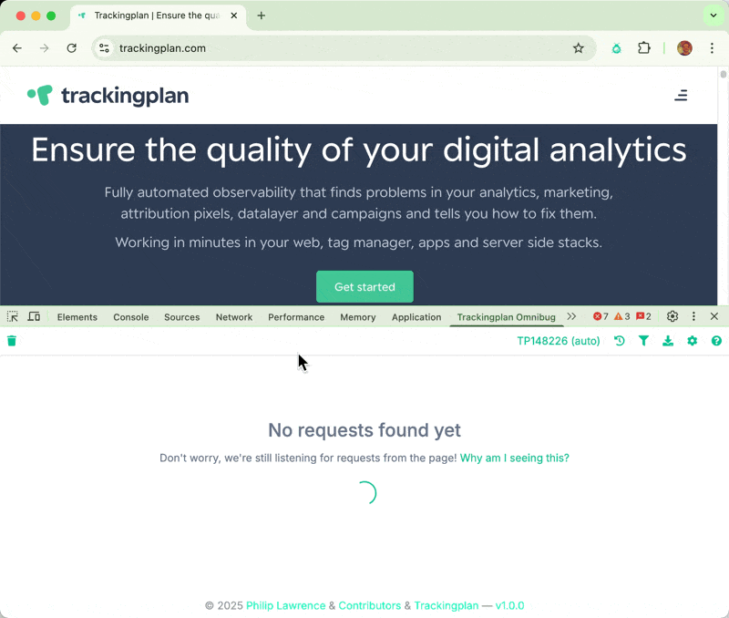

Trackingplan Omnibug
==========

**Note:** This is a forked version of Omnibug with Trackingplan integration. **All credit goes to the original Omnibug Creator and Contributors**. For further details, see the [main project page](https://omnibug.io/). You can find original source at the [Omnibug Github Repository](https://github.com/MisterPhilip/omnibug/).

This version is currently a playground for exploring the integration between Omnibug and Trackingplan functionality. It validates every request against your specification in Trackingplan.com. 

[Trackingplan](https://trackingplan.com/) is a data governance platform that automatically discovers, documents, and monitors your digital analytics implementations. It helps teams ensure data quality, prevent tracking issues, and maintain compliance across all their marketing and analytics tools.

## Get it

Since this is a preview version, you'll need to install it manually. Here are the builds and installation instructions for each platform:

### Download Links
- **Chrome**: [Download Chrome Extension (.zip)](https://raw.githubusercontent.com/trackingplan/tp-omnibug/master/build/chrome_production-1.0.0.zip)
- **Edge**: [Download Edge Extension (.zip)](https://raw.githubusercontent.com/trackingplan/tp-omnibug/main/build/edge_production-1.0.0.zip)
- **Firefox**: [Download Firefox Extension (.zip)](https://raw.githubusercontent.com/trackingplan/tp-omnibug/master/build/edge_production-1.0.0.zip)

### Installation Instructions

**For Chrome:**
1. Download the Chrome extension file from the link above
2. Extract the .zip file to a folder on your computer
3. Open Chrome and go to `chrome://extensions/`
4. Enable "Developer mode" in the top right corner
5. Click "Load unpacked" and select the extracted folder
6. The Trackingplan Omnibug extension should now appear in your extensions list

**For Microsoft Edge:**
1. Download the Edge extension file from the link above
2. Extract the .zip file to a folder on your computer
3. Open Edge and go to `edge://extensions/`
4. Enable "Developer mode" in the left sidebar
5. Click "Load unpacked" and select the extracted folder
6. The Trackingplan Omnibug extension should now appear in your extensions list

**For Firefox:**
1. Download the Firefox extension file (.zip) from the link above
2. Extract the .zip file to a folder on your computer
3. Open Firefox and go to `about:debugging`
4. Click "This Firefox" in the left sidebar
5. Click "Load Temporary Add-on..."
6. Navigate to the extracted folder and select the `manifest.json` file
7. The Trackingplan Omnibug extension should now appear in your add-ons list

## Contributing
Please, contribute directly into the main project, at [Omnibug Github Repository](https://github.com/MisterPhilip/omnibug/).
